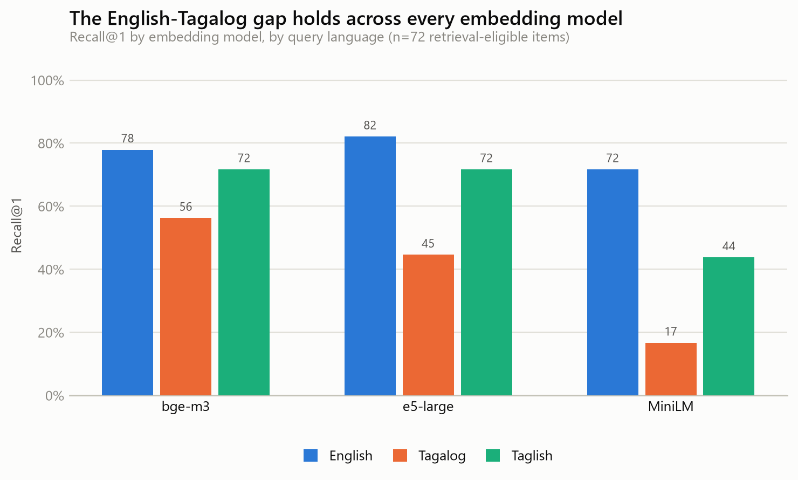
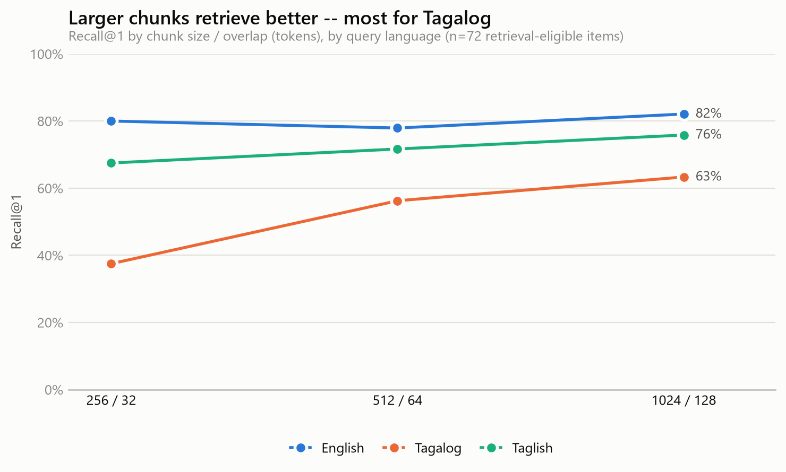
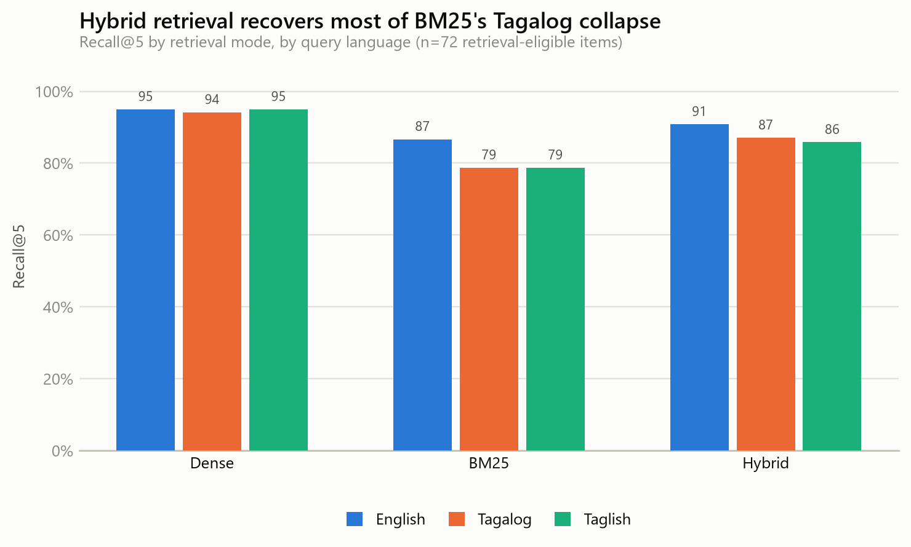
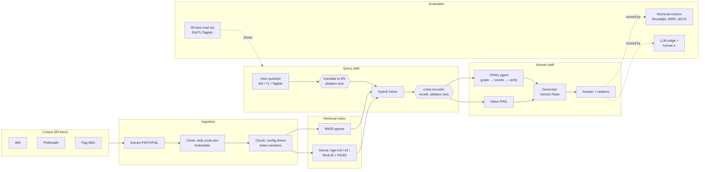

# Taglish-RAG

**A Retrieval & Evaluation Benchmark for Code-Switched Filipino QA**

A RAG system that answers questions about Philippine public services (BIR taxes, PhilHealth, Pag-IBIG Fund) from official government documents — asked in **English, Tagalog, or Taglish** (code-switched Filipino) against a corpus that is entirely English-language text. The system is half the project; the other half is a reproducible **evaluation harness with a 6-axis ablation table**, because "I built a RAG system" is the most common line on 2026 grad resumes and this project exists to move past it.

<!-- RESULTS_TABLE_PLACEHOLDER -->
<!-- BEGIN:GENERATED -->
**Headline finding:** BM25-only retrieval (the default in most RAG tutorials) hits the right document on the first try 71.7% of the time for English questions — and just 2.9% of the time for the *same* question asked in Tagalog, against this English-only government corpus.

| Config | Recall@1 | Recall@5 | Recall@10 | MRR | nDCG@10 | Recall@1 (EN / TL / Taglish) |
|---|---|---|---|---|---|---|
| Baseline (bge-m3, hybrid, chunk 512/64, no reranker) | 67.9% | 87.9% | 91.3% | 0.844 | 0.846 | 77.9% / 54.2% / 71.7% |
| **Best measured** (True on the Cross-encoder reranker axis, other settings at baseline) | 80.4% | 94.0% | 95.3% | 0.950 | 0.935 | 82.1% / 79.2% / 80.0% |

Retrieval-only numbers (n=72 retrieval-eligible items out of the 90-item eval set; the 18 deliberately unanswerable items have no gold document and are scored separately as refusal accuracy, see Limitations). Generation-stage metrics (groundedness, answer correctness, citation accuracy, refusal accuracy, judge-vs-human κ) require a configured `GOOGLE_API_KEY` and are not included here -- see Limitations.
<!-- END:GENERATED -->

## Why this exists

Multilingual RAG evals exist for European languages; a Taglish, code-switched benchmark against an English-only government corpus was not (to my knowledge) publicly available. BIR/PhilHealth/Pag-IBIG confusion is also a genuinely common, relatable Filipino problem — not a toy dataset.

## What's in the repo

| Path | What |
|---|---|
| `data/raw/{bir,philhealth,pagibig}/` | 83 scraped government documents (RMCs, circulars, FAQ pages) + manifests |
| `src/taglish_rag/scraping/` | Scrapers (BIR: curated seed list from a JS-rendered site's CDN; PhilHealth: direct crawl; Pag-IBIG: browser-rendered, see limitations) |
| `src/taglish_rag/ingest/` | PDF/HTML extraction, cross-document boilerplate stripping, config-driven token chunking |
| `eval/taglish_rag_eval_v1.jsonl` | 90 hand-authored Q/A pairs (30 EN / 30 TL / 30 Taglish), see `eval/DATASHEET.md` |
| `src/taglish_rag/retrieval/` | BM25, dense (sentence-transformers), hybrid fusion, cross-encoder reranking, query translation |
| `src/taglish_rag/agent/crag.py` | LangGraph self-correcting CRAG loop (retrieve → grade → rewrite → generate → verify) |
| `src/taglish_rag/generation/` | Gemini-backed answer generator + LLM-as-judge |
| `src/taglish_rag/eval/` | Retrieval metrics, ablation runner, generation eval, judge-vs-human κ |
| `app/app.py` | Gradio demo (citation display, CRAG toggle) |

## Quickstart

```bash
uv sync
cp .env.example .env   # optional -- retrieval works fully offline without this

# corpus is already committed under data/raw/ and data/processed/ -- to
# re-scrape or re-chunk from scratch:
uv run python -m taglish_rag.scraping.philhealth
uv run python -m taglish_rag.scraping.bir
uv run python -m taglish_rag.ingest.pipeline --all-sweep-sizes

# retrieval eval (works with zero API keys)
uv run python -m taglish_rag.eval.runner --mode hybrid --embedding-model bge-m3

# full 6-axis ablation sweep
uv run python -m taglish_rag.eval.ablate

# generation eval (needs GOOGLE_API_KEY in .env)
uv run python -m taglish_rag.eval.generation_runner --label baseline
uv run python -m taglish_rag.eval.generation_runner --use-agent --label crag
```

Each eval item costs two Gemini calls (one answer, one judge), so a full 90-item
generation run is 180 requests. Google AI Studio's free tier allows 15 requests
per minute, so those calls are throttled client-side to that rate -- a full run
takes ~12 minutes and prints per-item progress plus an ETA. Set `GEMINI_MAX_RPM`
in `.env` to raise the cap on a paid key. Every finished item is checkpointed to
`results/generation_<label>.partial.jsonl`, so an interrupted run resumes where it
stopped when you re-run the same command (`--no-resume` forces a clean start).

```bash
# demo
uv run python app/app.py
```

## Corpus

150–300 docs is more than needed for a benchmark this size; this ships **83** documents scope-locked to 3 agencies (BIR, PhilHealth, Pag-IBIG), prioritizing that every document is real, fetched, and verifiable over hitting a round number:

- **BIR (30 docs)**: the live site (bir.gov.ph) is a client-rendered Next.js app with no crawlable listing pages, but its PDFs are served from an un-gated CDN. Rather than a generic crawler, this uses a curated seed list (`configs/bir_seed_urls.txt`) of issuance URLs gathered via search and scoped to individual-taxpayer topics: ITR filing/penalties, VAT/percentage-tax registration, EOPT-Act invoicing rules, donor's tax.
- **PhilHealth (37 docs)**: a classic server-rendered site, crawled directly (`src/taglish_rag/scraping/philhealth.py`) — circular archive pages per year, plus member-category FAQ pages.
- **Pag-IBIG (16 docs)**: pagibigfund.gov.ph sits behind bot-detection that blocks plain HTTP clients (`requests`/`curl`) even for public pages, but not a real browser session — these 16 pages were fetched via an interactive browser and parsed from the rendered text (`scripts/parse_browser_batch.py`), not scraped programmatically. See `eval/DATASHEET.md` for what this means for corpus reproducibility.

All three are Philippine government works and public domain per IP Code §176.

## Evaluation set

**90 hand-authored Q/A pairs**, every gold answer independently verified against the actual fetched document text before writing the question (not generated from an LLM's general knowledge of Philippine policy):

- **Languages**: 30 English / 30 Tagalog / 30 Taglish — each set of 3 is a parallel translation of the same question, so retrieval quality is comparable *for the same information need* across languages.
- **Question types**: 39 factual · 21 multi-hop · 18 unanswerable · 12 ambiguous.
- **Adversarial unanswerable items**: several cite a real, retrievable, topically-adjacent document with a *superficially similar but wrong* answer (an expired 2020–2023 tax rate, a dividend-rate table that stops at the prior year) — a system that retrieves the nearest chunk and answers confidently without checking recency will get these wrong. Others test whether the system recognizes a question about a different government agency entirely (SSS, LTO) rather than hallucinating from topical similarity.

Full methodology: `eval/DATASHEET.md`.

## Ablations

<!-- ABLATION_TABLE_PLACEHOLDER -->
<!-- BEGIN:GENERATED -->
### Embedding model

| Config | Recall@1 | Recall@5 | Recall@10 | MRR | nDCG@10 | Recall@1 (EN / TL / Taglish) | n |
|---|---|---|---|---|---|---|---|
| bge-m3 | 68.6% | 87.9% | 91.3% | 0.846 | 0.850 | 77.9% / 56.2% / 71.7% | 72 |
| multilingual-e5-large | 66.1% | 86.2% | 88.6% | 0.839 | 0.816 | 82.1% / 44.6% / 71.7% | 72 |
| minilm-multilingual | 44.0% | 74.4% | 79.6% | 0.595 | 0.633 | 71.7% / 16.7% / 43.8% | 72 |



### Chunk size / overlap

| Config | Recall@1 | Recall@5 | Recall@10 | MRR | nDCG@10 | Recall@1 (EN / TL / Taglish) | n |
|---|---|---|---|---|---|---|---|
| 256_32 | 61.7% | 88.6% | 89.3% | 0.816 | 0.817 | 80.0% / 37.5% / 67.5% | 72 |
| 512_64 | 68.6% | 87.9% | 91.3% | 0.846 | 0.850 | 77.9% / 56.2% / 71.7% | 72 |
| 1024_128 | 73.8% | 91.0% | 92.8% | 0.903 | 0.886 | 82.1% / 63.3% / 75.8% | 72 |



### Retrieval mode

| Config | Recall@1 | Recall@5 | Recall@10 | MRR | nDCG@10 | Recall@1 (EN / TL / Taglish) | n |
|---|---|---|---|---|---|---|---|
| dense | 78.3% | 94.7% | 95.0% | 0.920 | 0.922 | 80.0% / 79.2% / 75.8% | 72 |
| bm25 | 34.2% | 81.4% | 82.1% | 0.535 | 0.587 | 71.7% / 2.9% / 27.9% | 72 |
| hybrid | 68.6% | 87.9% | 91.3% | 0.846 | 0.850 | 77.9% / 56.2% / 71.7% | 72 |



### Cross-encoder reranker

| Config | Recall@1 | Recall@5 | Recall@10 | MRR | nDCG@10 | Recall@1 (EN / TL / Taglish) | n |
|---|---|---|---|---|---|---|---|
| False | 68.6% | 87.9% | 91.3% | 0.846 | 0.850 | 77.9% / 56.2% / 71.7% | 72 |
| True | 80.4% | 94.0% | 95.3% | 0.950 | 0.935 | 82.1% / 79.2% / 80.0% | 72 |

### Query translation to English

| Config | Recall@1 | Recall@5 | Recall@10 | MRR | nDCG@10 | Recall@1 (EN / TL / Taglish) | n |
|---|---|---|---|---|---|---|---|
| False | 68.6% | 87.9% | 91.3% | 0.846 | 0.850 | 77.9% / 56.2% / 71.7% | 72 |
| True | 73.8% | 89.6% | 92.5% | 0.879 | 0.872 | 80.0% / 71.7% / 69.6% | 72 |

### Naive RAG vs. LangGraph self-correcting CRAG loop

| Config | n | Groundedness | Correctness | Citation acc. | Refusal acc. | Mean latency |
|---|---|---|---|---|---|---|
| Naive RAG | 90 | 1.000 | 0.947 | 1.000 | 0.167 | 3.7s |
| CRAG (grade → rewrite → verify) | 90 | 1.000 | 0.963 | 1.000 | 0.222 | 8.6s |

Both arms use the same retriever (minilm-multilingual) and the same judge, so the only difference is the agent loop. CRAG buys 1.7 points of correctness for 2.3x the latency -- the grading call and any rewrite-and-retry are extra round trips. Latency excludes the judge call, which is identical on both arms. **Refusal accuracy is measured by a string-matcher that undercounts correct refusals -- read that column as a lower bound, not as a comparison between the two arms** (see Limitations).
<!-- END:GENERATED -->

## Architecture



Design choices worth calling out:
- **Gold citations are document-level, not chunk-level** (`gold_doc_ids`, not `gold_chunk_ids`) — chunk IDs are config-dependent (they change with chunk size/overlap), so document-level gold labels are what let the *same* 90-item eval set stay valid across the entire chunking ablation axis without relabeling.
- **Query translation uses a local MarianMT model** (`Helsinki-NLP/opus-mt-tl-en`), not an LLM call, so that ablation axis runs with zero API keys configured.
- **Boilerplate stripping is cross-document, not per-site**: any line recurring across ≥40% of an agency's scraped pages (nav menus, footers) is dropped automatically rather than hand-written per template — see `src/taglish_rag/ingest/clean.py`.

## Limitations

- **Corpus snapshot, not a live feed**: several BIR circulars describe time-bound rates/deadlines (e.g. a temporary tax rate that expired in 2023). This is used deliberately to construct adversarial unanswerable questions (see above), but means gold answers should not be treated as current tax/benefit advice.
- **90 vs. the original 120-question target**: scaled down proportionally, prioritizing verified accuracy over a round number (see `eval/DATASHEET.md`).
- **Single annotator**: all eval items were authored by one person in one pass; judge-vs-human agreement (Cohen's κ) is computed on a 30-item sample once a real generator backend is configured (see `eval/human_labels/README.md`) — it is not fabricated in this repo.
- **PhilHealth 2024 circulars**: several downloaded as scanned/image PDFs with no extractable text layer; no eval questions cite them.
- **Refusal accuracy is not yet trustworthy**: both generation runs are complete (90 items each, see above), but refusal accuracy comes out at 0.22 (CRAG) and 0.17 (naive) because the refusal detector is a string-matcher that undercounts correct refusals — the model often declines in Taglish, or hedges rather than refusing outright, and the matcher misses both. Treat that one column as a lower bound until it is replaced; the other generation metrics are unaffected. See `todo.md`.
- Generation-stage numbers need a configured `GOOGLE_API_KEY` to reproduce. Ingestion, retrieval, and the full ablation sweep all run offline; only generation and the LLM-as-judge need a key.


## License

MIT (code) / CC-BY-4.0 (eval set) — see `LICENSE` and `eval/DATASHEET.md`. Source documents are public domain per Philippine IP Code §176.
